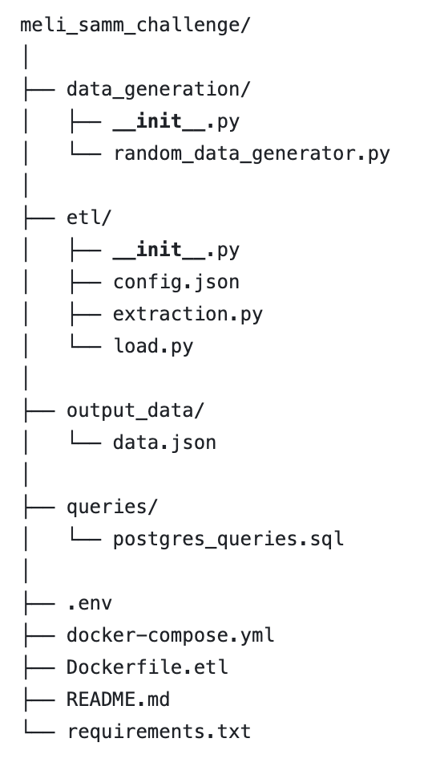
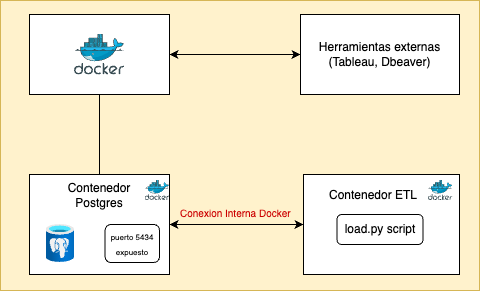

# Meli SAMM Challenge

### Descripción del Proyecto

Este proyecto es una solución ETL diseñada para monitorear el uso de la aplicación y el progreso de las tareas asociadas a proyectos en la aplicación Todoist. Utilizando un entorno de contenedores con Docker, se implementa una arquitectura que permite la extracción, transformación y carga (ETL) de datos hacia una base de datos PostgreSQL, simulando el consumo de datos de la API de Todoist. La información es posteriormente visualizada en Tableau.

  👉 <a href="https://public.tableau.com/app/profile/alejandra.perpi.n7519/viz/meli_challenge/MonitoreoTodoist?publish=yes">Accede al dashboard que responde a las preguntas del challenge</a> 👈

### Simulación de Datos

Para este proyecto, la información se simula mediante la generación de datos aleatorios que emulan la estructura de los objetos `proyectos`, `tareas` y `actividades` de la API de Todoist. La generación de datos se realiza en el archivo `data_generation/random_data_generator.py`, utilizando la librería `Faker`
El objetivo de la simulación de datos es proporcionar un conjunto de datos realista que permita:
- Probar el proceso ETL para verificar la correcta carga y transformación de datos en PostgreSQL.
- Proveer datos suficientes para responder a las preguntas del challenge y generar visualizaciones en Tableau.
- Emular escenarios de uso de la aplicación Todoist, incluyendo el comportamiento de usuarios, estados de tareas y progreso de proyectos a lo largo del tiempo.

### Estructura del Proyecto

La estructura de carpetas es la siguiente:

  

A continuación se detalla el contenido de cada archivo:
- **`data_generation/random_data_generator.py`**: Genera los datos de prueba que replican el comportamiento de los objetos proyectos, tareas y actividades de la API Todoist.
- **`etl/config.json`**: Archivo de configuración que define las rutas de salida y otros parámetros necesarios.
- **`etl/extraction.py`**: Extrae los datos simulados y los guarda en formato JSON.
- **`etl/load.py`**: Carga los datos en PostgreSQL a partir del archivo JSON generado.
- **`output_data/data.json`**: Archivo de datos generado por `extraction.py`, que contiene los datos simulados.
- **`queries/postgres_queries.sql`**: Contiene las consultas SQL que alimentan el tablero en Tableau para responder las preguntas del challenge.
- **`.env`**: Archivo de variables de entorno para almacenar configuraciones sensibles, como credenciales de la base de datos.
- **`docker-compose.yml`**: Configuración de Docker Compose para levantar los contenedores del proyecto.
- **`Dockerfile.etl`**: Configura el contenedor ETL que ejecuta el proceso de carga de datos en la base de datos.
- **`requirements.txt`**: Lista de dependencias de Python requeridas para el proyecto.

### Diagrama de la Arquitectura

  

#### Descripción de la Arquitectura

Este proyecto utiliza una arquitectura en contenedores, lo que permite ejecutar cada componente en entornos aislados, manteniendo una integración controlada y segura. La arquitectura se compone de los siguientes elementos:

- **Contenedor de PostgreSQL**:
  - Aloja la base de datos que almacena los datos simulados de proyectos, tareas y actividades.
  - El puerto `5433` está expuesto para permitir la conexión de herramientas externas y otros contenedores.

- **Contenedor ETL**:
  - Ejecuta el proceso de carga y transformación de datos mediante el script `load.py`, que inserta los datos en la base de datos PostgreSQL.
  - Se conecta al contenedor de PostgreSQL a través de variables de entorno definidas en el archivo `.env`, lo que permite flexibilidad y seguridad al no exponer credenciales en el código.

- **Herramientas Externas**:
  - Herramientas como Tableau y DBeaver pueden conectarse a la base de datos PostgreSQL utilizando el puerto expuesto, lo que facilita la visualización y el análisis de datos.
  - Tableau se utiliza para crear dashboards que permiten responder a las preguntas del challenge, y DBeaver permite una administración directa de la base de datos.

- **Docker Compose**:
  - Orquesta y gestiona los contenedores, asegurando que cada uno se inicie con las configuraciones necesarias.
  - Define las conexiones de red entre contenedores, asegurando que el contenedor ETL pueda comunicarse con el contenedor de PostgreSQL sin problemas.

Esta arquitectura en contenedores facilita el despliegue en cualquier entorno y asegura que cada componente pueda ejecutarse de forma independiente, promoviendo buenas prácticas de escalabilidad, seguridad y mantenimiento.

